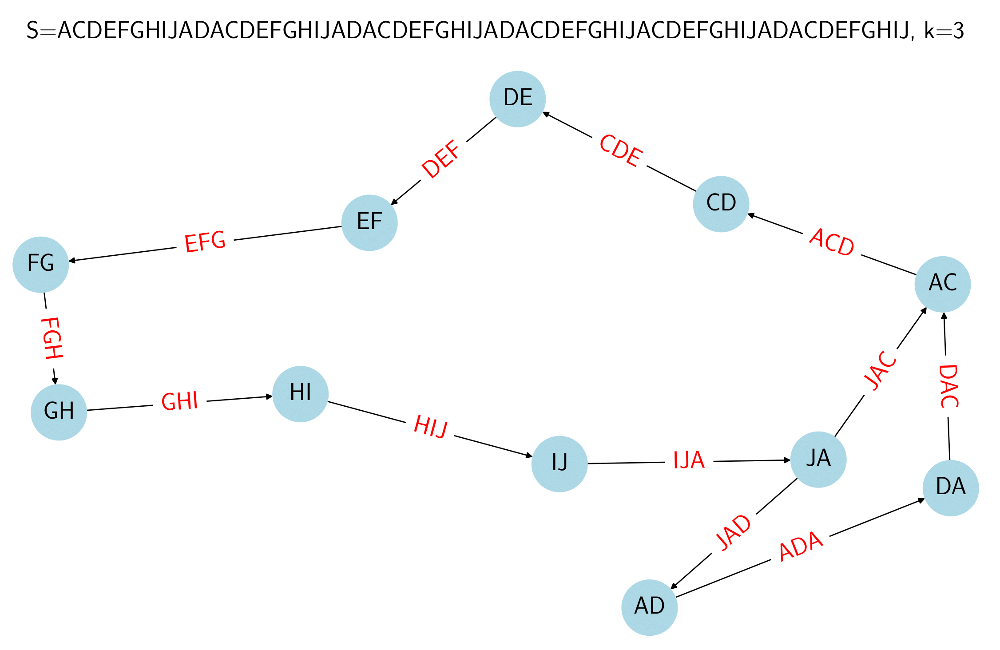
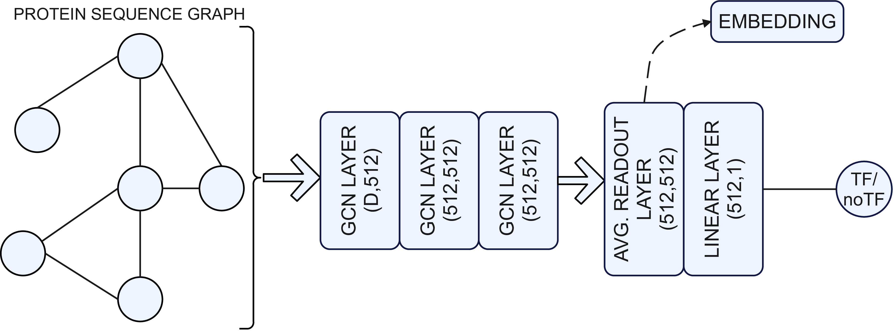

# Proteins-Transcription-Factor-Prediction-using-GNN
This repository provides an innovative deep-learning methodology designed to predict the presence of transcription factors in protein sequences. The model can accurately classify proteins based on their structural and sequential features by representing sequences as graphs and leveraging the power of Graph Neural Networks (GNNs).

## Datasets

- **All dataset**: Contains 3000 TF and 9000 no-TF sequences sampled without considering the organism type.
- **Eukaryotic dataset**: Contains 3000 TF and 9000 no-TF sequences sampled from sequences belonging to eukaryotic organisms.
- **Prokaryotic dataset**: Contains 3000 TF and 9000 no-TF sequences sampled from sequences belonging to prokaryotic organisms.
- **Virus dataset**: Contains 538 TF and 1614 no-TF sequences sampled from sequences belonging to virus organisms.

## Graph Construction
- Identification of the $k$-mers of the sequence $S$ (the number of possible $k$-mers of $S$ is $L-k+1$ where $L = \lvert S \rvert$)
- Assignment of $(k-1)$-mers to the nodes
- Connect one node to another if the $(k-1)$-mer overlaps another

To each node, we assign a feature vector containing the information about the one-hot encoding of the $(k-1)$-mer and its positional information obtained via positional encoding. 



## Transcription Factor Prediction
The proposed GNN consists of three stacked GCN layers with 512 units. After every GCN layer, we apply dropout with a rate of 0.5 to prevent overfitting. The final part of the net consists of an average \emph{READOUT} layer and a linear layer with one unit with the Sigmoid activation function, which performs the final classification. 



## Installation

To install the required dependencies, use:

```bash
pip install -r requirements.txt
```
## Usage
To convert a protein sequence into a graph use:
```python
from dgbpos import create_dgb
S="ACDEFGHIKLMNPQRSTVWY"
k=5
emb_size=128
g=create_dgb(S,k,emb_size)
print(g)
```
To test our proposal, for instance for the Virus dataset:
```bash
python run_graphtf.py -d Virus -k 5 -e 128
```

To use this model cite:
```
@inproceedings{amato12025proteins,
  title={Proteins Transcription Factor Prediction Using Graph Neural Networks},
  author={Amato, Domenico and Calderaro, Salvatore and Lo Bosco, Giosu{\'e} and Vella, Filippo and Rizzo, Riccardo},
  booktitle={Computational Intelligence Methods for Bioinformatics and Biostatistics: 19th International Meeting, CIBB 2024, Benevento, Italy, September 4--6, 2024, Revised Selected Papers},
  volume={15276},
  pages={15},
  year={2025},
  organization={Springer Nature}
}
```
